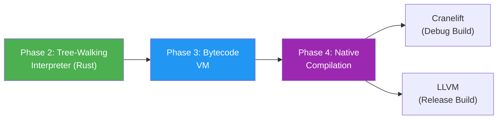

# Roadmap

The development of the `oi` language is structured logically into four primary phases, minimizing risk by securing the specification early, and progressively stepping toward native execution.

## Phase 1: Language Design (Current Phase)
**Goal:** Define the language behavior so that AI generation and human review can be tested mentally or statically.
- ✅ Establish Core Principles (The 5 Pillars).
- ✅ Decide on Language Name (`oi`).
- ✅ Document high-level syntax references and error handling paradigms.
- ✅ Decide on memory management strategy: automatic GC, no user-facing memory syntax (ADR-0012).
- ✅ Decide on concurrency model: Actor + Structured Concurrency hybrid (ADR-0013).
- ⬜ Draft precise semantics for effect validation over the `with` keyword.
- ⬜ Map out the standard library architecture and initial RFC templates.
- ⬜ Define the bidirectional collaboration workflow (human writes spec → AI implements).
- ⬜ Design contract verification semantics for `requires`/`ensures`.
- ⬜ Refine `actor` / `concurrent` syntax details.
- **Timeline**: Present ~ Month 1

## Phase 2: Tree-Walking Interpreter
**Goal:** Run real `oi` code for the first time without complex backends.
- **Implementation Language**: `Rust`
- **Parser**: Leverage `chumsky` or `nom`.
- **Features**:
  - Source-to-AST translation respecting the "One Canonical Form".
  - Basic Type Checker and Effect validation.
  - Contract verification engine (`requires`/`ensures` runtime checking).
  - A Tree-Walking execution mechanism.
  - An interactive REPL environment.
  - Spec-only mode: accept signature + contracts without a body (for bidirectional AI collaboration).
- **Error Reporting**: Leverage `ariadne` for high-quality, human-readable terminal errors.
- **Timeline**: ~3 Months

## Phase 3: Bytecode VM
**Goal:** Achieve practical speeds for script execution and expand the language tooling.
- **Implementation**: Migrate the tree-walker to emit opcodes.
- **Features**:
  - Compile AST to custom Bytecode Instructions.
  - Stack-based Virtual Machine with single-heap tracing GC (ADR-0012).
  - Actor runtime: process spawning, message passing, mailbox management (ADR-0013).
  - `concurrent.all` implementation for structured parallelism (ADR-0013).
  - Start implementing standard library fundamentals.
- **Timeline**: 3 to 9 Months

## Phase 4: Native Backend & Self-Hosting
**Goal:** Production level performance targeting multiple ISAs via standard pipelines.
- **Backends**:
  - `Cranelift`: Used for fast debug builds and rapid development iterations.
  - `LLVM`: Used for final optimized release artifacts.
- **Memory Management**: Migrate to per-process GC aligned with actor model (ADR-0012).
- **Concurrency**: Supervision trees, actor discovery/registry, potential shared data store (ADR-0013).
- **Self-Hosting**: The eventual milestone is rewriting the `oi` compiler using `oi` itself.
- **Additional Tooling**: `oi-fmt` for the unified formatting, LSP server implementations natively geared to AI IDEs.
- **Timeline**: 9 Months ~ 1+ Year

## Backend Strategy Summary

